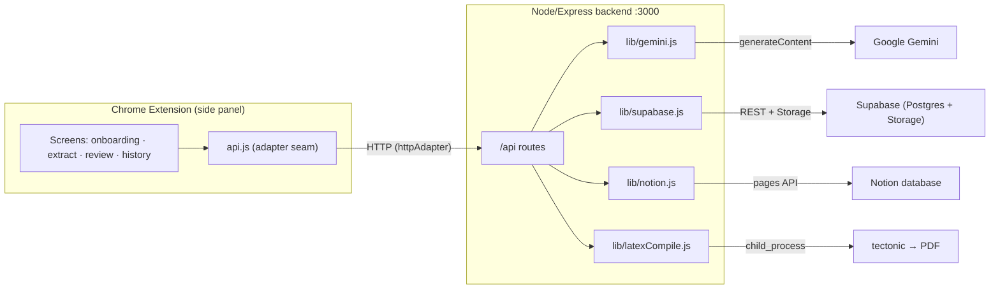
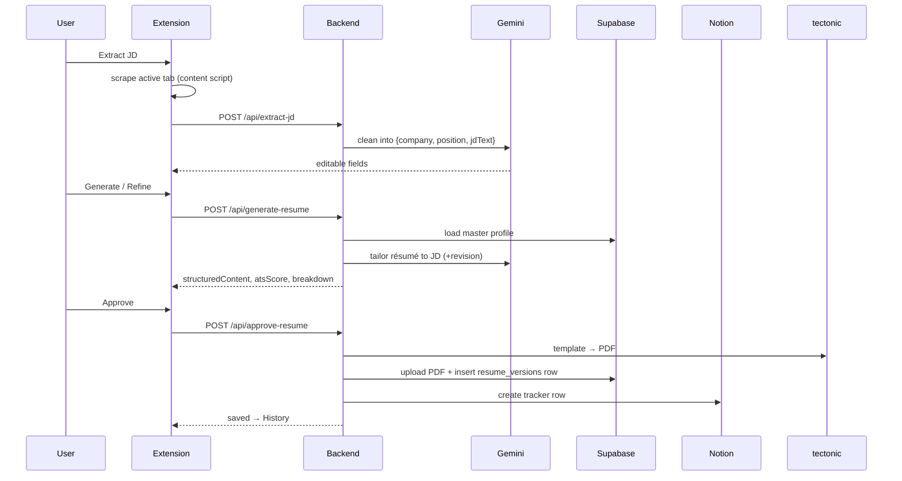

# FirSeCV

**Extract a job description, generate a résumé tailored to it, review and refine it with a live ATS score, then keep a permanent, searchable record of every application — all from the page you're applying on.**

FirSeCV is a Chrome side-panel extension backed by a small Node/Express service. You set up a structured **Master Data** profile once (your experience, projects, skills, education). Then, on any job posting, you click **Extract** to pull the description off the page, generate a résumé tailored to that JD (real LLM), review it with an ATS score and keyword breakdown, refine it by chatting ("shorten the projects section", "emphasize backend"), and approve. On approval the résumé is compiled to a real PDF, stored in Supabase, and logged as a row in a Notion tracker — so months later you know exactly what you sent, to whom, and when, and can retrieve the exact file.

---

## Table of contents

- [Why this beats "just ask an LLM"](#why-this-beats-just-ask-an-llm)
- [Architecture at a glance](#architecture-at-a-glance)
- [The complete workflow](#the-complete-workflow)
- [What happens on each action (data flow)](#what-happens-on-each-action-data-flow)
- [Tech stack](#tech-stack)
- [The integrations](#the-integrations)
- [Resilience: mocks, fallbacks, and rate limits](#resilience-mocks-fallbacks-and-rate-limits)
- [Setup](#setup)
- [Project structure](#project-structure)
- [Data models](#data-models)
- [Backend API reference](#backend-api-reference)
- [Troubleshooting](#troubleshooting)
- [Roadmap](#roadmap)

---

## Why this beats "just ask an LLM"

A chat assistant can rewrite a résumé — if you paste everything in by hand, every single time. FirSeCV gives you:

1. **A persistent structured profile** you set up once and reuse everywhere.
2. **One-click JD capture** from the actual page you're applying on.
3. **A real document + ATS score** — a compiled PDF you can download, not chat text.
4. **Permanent memory** — every approved résumé tied to the exact company, role, and date, always retrievable from Notion + Supabase.

It's an end-to-end workflow tool, not a prompt.

---

## Architecture at a glance



**Key design decision — the adapter seam.** The extension talks to the backend only through [`src/lib/api.js`](src/lib/api.js), which delegates to one of two interchangeable adapters:

- `mockAdapter` — everything runs in-panel with deterministic logic and `chrome.storage.local`. Zero setup; great for demos.
- `httpAdapter` — real calls to the Express backend.

Flip one constant (`USE_MOCK`) to switch the entire app between demo and live. Nothing in the UI knows which is active. The backend mirrors the same idea: each integration falls back to a local implementation when its key is absent, so the whole pipeline works before any credential exists.

---

## The complete workflow

1. **First-time setup** — open the panel; if no profile exists, onboarding appears. Paste your existing résumé → Gemini structures it into the Master Data schema → review/edit the details → save.
2. **On a job posting** — navigate to a careers/job page and open the panel.
3. **Extract** — click *Extract JD from this page*. A content script reads the page (trying known ATS containers, falling back to full text); Gemini cleans it into `{ company, position, jdText }`. You confirm/edit these — extraction is never trusted silently.
4. **Generate** — Gemini builds a résumé from your Master Data tailored to the JD (selecting and rewriting the most relevant experience/projects), and an ATS score + matched/missing keyword breakdown is computed.
5. **Review & refine** — see a paper-styled preview, the ATS ring, and keyword chips. Type revision requests in the chat box ("shorten projects", "emphasize ML") — it regenerates and re-scores, looping until you're happy.
6. **Approve** — the content is rendered to LaTeX and compiled to a **real PDF**, uploaded to **Supabase Storage**, recorded in the `resume_versions` table, and a row is created in your **Notion** tracker (Company / Position / Date / ATS Score / Resume Link / Status).
7. **Retrieve later** — the History screen lists every application, searchable by company. Open any entry to see the full approved résumé (preview + ATS breakdown) again and **download the PDF**.

---

## What happens on each action (data flow)



---

## Tech stack

| Layer | Choice | Why |
|---|---|---|
| Extension | Chrome Manifest V3, **side panel**, vanilla JS/HTML/CSS, ES modules | Side panel persists through the multi-step flow; no build step keeps iteration fast |
| JD capture | `chrome.scripting.executeScript` (on-demand) | Reads the active tab only when you click Extract |
| Backend | Node.js + Express | Keeps all API keys off the client |
| LLM | Google **Gemini** (`gemini-flash-lite-latest` by default) | Résumé parsing, JD extraction, tailored generation |
| PDF | **tectonic** (bundled, self-contained TeX engine) via `child_process` | Real LaTeX → PDF, no system TeX install |
| Data + files | **Supabase** (Postgres via REST + Storage) | Structured profile, résumé versions, PDF hosting |
| Tracker | **Notion** API | Human-facing application tracker |
| Local state | `chrome.storage.local` | Theme + mock-mode persistence |

No paid APIs — every service has a usable free tier or is open-source/self-hosted.

---

## The integrations

Each lives in `backend/lib/` behind a clean function surface. All are **live when their keys are present, mocked otherwise**.

- **Gemini** ([lib/gemini.js](backend/lib/gemini.js)) — `parseResume`, `extractJd`, `generateResume`, plus a rules-based `scoreResume`. Real calls use `responseMimeType: application/json`, with **retry/backoff** honoring Google's `retryDelay`, and a **local fallback** if rate-limited so the app never breaks.
- **Supabase** ([lib/supabase.js](backend/lib/supabase.js)) — profiles and résumé versions over PostgREST; PDF upload to a public Storage bucket (auto-created on first run). No SDK dependency — plain `fetch`.
- **Notion** ([lib/notion.js](backend/lib/notion.js)) — creates a tracker page. The payload matches your database's actual property names/types (title, rich_text, date, number, url, select).
- **LaTeX** ([lib/latexCompile.js](backend/lib/latexCompile.js)) — fills [templates/template.tex](backend/templates/template.tex) (with `\resumeEntry` macros) and compiles via the bundled tectonic binary; returns `null` gracefully if no engine is available, in which case the `.tex` source is stored instead.

---

## Resilience: mocks, fallbacks, and rate limits

- **No keys?** Every integration mocks locally; the pipeline still runs end to end.
- **Gemini rate-limited?** After retry/backoff it falls back to the local generator and logs it — you always get a résumé.
- **No TeX engine?** Approval stores the `.tex` source and skips the PDF; the extension can still download the LaTeX.
- **Free-tier note:** Gemini's free tier is per-minute and per-day *per model*. Normal use (occasional clicks) is fine; rapid repeated calls can hit the per-minute cap — the backoff handles transient cases.

---

## Setup

### 1. Backend

```bash
cd backend
npm install
cp .env.example .env      # fill in the keys below
```

`.env` keys (all optional — absent ones run mocked):

| Key | Purpose |
|---|---|
| `GEMINI_API_KEY` | Google Gemini (free tier) |
| `GEMINI_MODEL` | optional model override (default `gemini-flash-lite-latest`) |
| `SUPABASE_URL` | base project URL *or* REST endpoint (normalized automatically) |
| `SUPABASE_SERVICE_ROLE_KEY` | service role key (bypasses RLS for the demo) |
| `NOTION_TOKEN` | Notion integration token |
| `NOTION_DATABASE_ID` | the tracker database id |
| `LATEX_ENGINE` | `tectonic` (default) or `pdflatex` |

### 2. Supabase

Run [backend/db/schema.sql](backend/db/schema.sql) once in the **SQL Editor** (idempotent — safe to re-run when the schema grows). The Storage bucket `resumes` is created automatically on first backend run.

### 3. Notion

Create a database with a **title** property plus **Company, Position, Date Applied, ATS Score, Resume Link, Status**, and share it with your integration. The code adapts to your exact property names/types.

### 4. Run

```bash
npm start                 # http://localhost:3000  — GET /health shows live/mock per integration
```

First LaTeX compile downloads the tectonic package bundle once (~1–2 min); subsequent compiles take a few seconds.

### 5. Extension

`chrome://extensions` → enable **Developer mode** → **Load unpacked** → select the repo root. Click the FirSeCV icon. The extension calls the running backend (`USE_MOCK = false` in [src/lib/api.js](src/lib/api.js); set `true` to demo standalone).

---

## Project structure

```
manifest.json               Manifest V3 (side panel)
background.js               Opens the side panel on icon click
src/
  sidepanel/               Panel shell, styles, router + theme
  lib/
    api.js                 Facade over the active adapter
    mockAdapter.js         In-panel mock backend
    httpAdapter.js         Real backend client (normalizes DB rows)
    store.js               chrome.storage.local wrapper
    extract.js             Page scraper injected into the tab
  ui/
    screens.js             Onboarding, extract, review, history, detail
    components.js          toast, skeleton, ATS ring, chips, DOM builder
backend/
  server.js                Express app + routes + error handler
  config.js                Env + integration feature flags
  routes/                  One file per endpoint
  lib/                     gemini, supabase, notion, latexCompile
  templates/template.tex   LaTeX résumé template
  db/schema.sql            Supabase tables
  bin/                     Bundled tectonic (gitignored, downloaded)
```

---

## Data models

**Supabase `master_profiles`** — `user_id` (text, pk), `data` (jsonb: the full profile), `updated_at`.

**Supabase `resume_versions`** — `id`, `user_id`, `company`, `position`, `jd_text`, `ats_score`, `ats_breakdown` (jsonb), `structured_content` (jsonb), `pdf_storage_path`, `resume_url`, `latex_source`, `status`, `notion_page_id`, `applied_at`.

**Notion tracker** — title (e.g. "Company — Position"), Company, Position (text), Date Applied (date), ATS Score (number), Resume Link (url), Status (select).

---

## Backend API reference

| Method & path | Body / query | Returns |
|---|---|---|
| `GET /health` | — | `{ ok, integrations }` |
| `GET /api/master-profile` | — | profile or `404` |
| `POST /api/master-profile` | `{ resumeText }` or full profile | saved profile |
| `PATCH /api/master-profile` | partial fields | merged profile |
| `POST /api/extract-jd` | `{ rawPageText, pageUrl }` | `{ company, position, jdText }` |
| `POST /api/generate-resume` | `{ jdText, revisionInstruction?, previousContent? }` | `{ structuredContent, atsScore, atsBreakdown }` |
| `POST /api/approve-resume` | `{ company, position, jdText, atsScore, atsBreakdown, structuredContent }` | `{ id, resumeUrl, notionPageId, hasPdf }` |
| `GET /api/search-resumes` | `?company=` | `resume_versions[]` |

---

## Troubleshooting

- **`SUPABASE_URL` mistakes** — pasting the REST endpoint (`…/rest/v1/`) instead of the base URL is handled automatically (normalized to the base).
- **Gemini 429** — free-tier per-minute/day limit; the backoff retries, then falls back to local generation. Switch `GEMINI_MODEL` to another flash model for a fresh per-model quota.
- **`column … does not exist`** — re-run [backend/db/schema.sql](backend/db/schema.sql); it adds any new columns idempotently.
- **Port 3000 in use** — kill the stale server: PowerShell `Get-NetTCPConnection -LocalPort 3000 -State Listen | ForEach-Object { Stop-Process -Id $_.OwningProcess -Force }`.
- **Notion validation error** — a property name/type in your DB differs; the code targets the schema described above.

---

## Roadmap

- Supabase Auth (multi-user; replace the single demo user).
- Editable Master Data beyond onboarding (full experience/projects editor).
- Real Gemini-based ATS scoring option alongside the rules-based one.
- Status updates (Applied → Interview → Offer) synced back from Notion.

---

## Logo and icon attribution

<a href="https://www.flaticon.com/free-icons/socket" title="socket icons">Socket icons created by Freepik - Flaticon</a>
