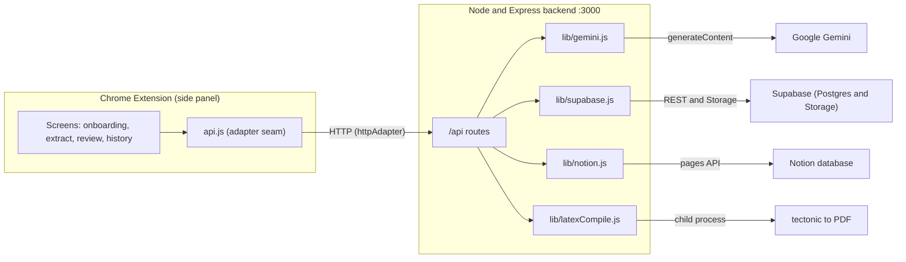
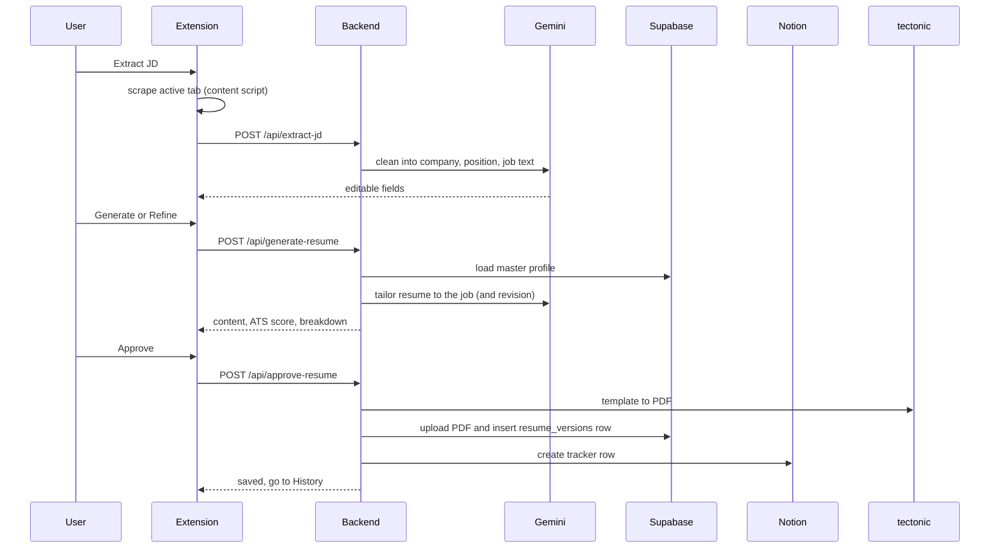

# FirSeCV

**Extract a job description, generate a resume tailored to it, review and refine it with a live ATS score, then keep a permanent, searchable record of every application, all from the page you are applying on.**

FirSeCV is a Chrome side panel extension backed by a small Node and Express service. You set up a structured Master Data profile once (your experience, projects, skills, education). Then, on any job posting, you click Extract to pull the description off the page, generate a resume tailored to that job (real AI), review it with an ATS score and keyword breakdown, refine it by chatting (for example "shorten the projects section" or "emphasize backend"), and approve. On approval the resume is compiled to a real PDF, stored in Supabase, and logged as a row in a Notion tracker. Months later you know exactly what you sent, to whom, and when, and you can get the exact file back.

---

## Table of contents

- [Why this beats just asking an AI](#why-this-beats-just-asking-an-ai)
- [Architecture at a glance](#architecture-at-a-glance)
- [The complete workflow](#the-complete-workflow)
- [What happens on each action](#what-happens-on-each-action)
- [Tech stack](#tech-stack)
- [The integrations](#the-integrations)
- [Resilience: mocks, fallbacks, and rate limits](#resilience-mocks-fallbacks-and-rate-limits)
- [Setup](#setup)
- [Project structure](#project-structure)
- [Data models](#data-models)
- [Backend API reference](#backend-api-reference)
- [Troubleshooting](#troubleshooting)
- [Roadmap](#roadmap)

---

## Why this beats just asking an AI

A chat assistant can rewrite a resume, but only if you paste everything in by hand, every single time. FirSeCV gives you:

1. A saved structured profile you set up once and reuse everywhere.
2. One click job description capture from the actual page you are applying on.
3. A real document and ATS score, a compiled PDF you can download, not chat text.
4. Permanent memory. Every approved resume is tied to the exact company, role, and date, always available from Notion and Supabase.

It is a full workflow tool, not a prompt.

---

## Architecture at a glance



The key design decision is the adapter seam. The extension talks to the backend only through [src/lib/api.js](src/lib/api.js), which sends every call to one of two interchangeable adapters:

- The mock adapter runs everything in the panel with plain local logic and browser storage. Zero setup, good for demos.
- The http adapter makes real calls to the Express backend.

Flip one switch (USE_MOCK) to move the whole app between demo and live. Nothing in the UI knows which one is active. The backend works the same way: each integration falls back to a local version when its key is missing, so the whole flow runs before any credential exists.

---

## The complete workflow

1. Sign up or log in. Open the panel and create an account (or log in). Accounts use Supabase Auth, and all your data is scoped to your account. Then, if no profile exists yet, onboarding appears: paste your existing resume, the app structures it into the Master Data format, and you review, edit, and save it.
2. On a job posting. Go to a careers or job page and open the panel.
3. Extract. Click "Extract JD from this page". A content script reads the page (it tries known job board containers and falls back to the full text), then the app cleans it into company, position, and job text. You confirm or edit these, so extraction is never trusted blindly.
4. Generate. The app builds a resume from your Master Data tailored to the job (it picks and rewrites the most relevant experience and projects), and an ATS score plus a matched and missing keyword breakdown is computed.
5. Review and refine. See a paper styled preview, the ATS ring, and keyword chips. Type revision requests in the chat box (for example "shorten projects" or "emphasize ML"). It regenerates and re-scores, looping until you are happy.
6. Approve. The content is turned into LaTeX and compiled to a real PDF, uploaded to Supabase Storage, saved in the resume_versions table, and a row is added to your Notion tracker (Company, Position, Date, ATS Score, Resume Link, Status).
7. Get it back later. The History screen lists every application, searchable by company. Open any entry to see the full approved resume again (preview and ATS breakdown) and download the PDF.

---

## What happens on each action



---

## Tech stack

| Layer | Choice | Why |
|---|---|---|
| Extension | Chrome Manifest V3, side panel, plain JS, HTML, CSS, ES modules | The side panel stays open through the multi step flow, and no build step keeps changes fast |
| Job capture | chrome.scripting.executeScript, on demand | Reads the active tab only when you click Extract |
| Backend | Node.js and Express | Keeps all API keys off the client |
| AI | Google Gemini (gemini-flash-lite-latest by default) | Resume parsing, job extraction, tailored generation |
| PDF | tectonic (bundled, self contained TeX engine) run as a child process | Real LaTeX to PDF, no system TeX install |
| Data and files | Supabase (Postgres over REST and Storage) | Structured profile, resume versions, PDF hosting |
| Tracker | Notion API | The tracker you actually read |
| Local state | Browser storage | Theme and mock mode data |

No paid APIs. Every service has a usable free tier or is open source and self hosted.

---

## The integrations

Each one lives in backend/lib behind a clean set of functions. All are live when their keys are present and mocked otherwise.

- Gemini, in [lib/gemini.js](backend/lib/gemini.js). It does parseResume, extractJd, generateResume, plus a rules based scoreResume. Real calls ask for JSON output, retry with backoff that respects Google's suggested delay, and fall back to the local generator if rate limited, so the app never breaks.
- Supabase, in [lib/supabase.js](backend/lib/supabase.js). Profiles and resume versions over the REST API, and PDF upload to a public Storage bucket (created automatically on first run). No SDK, just plain fetch.
- Notion, in [lib/notion.js](backend/lib/notion.js). Creates a tracker row. The payload matches your database's real property names and types (title, text, date, number, url, select).
- LaTeX, in [lib/latexCompile.js](backend/lib/latexCompile.js). It fills [templates/template.tex](backend/templates/template.tex) (which defines resumeEntry style macros) and compiles with the bundled tectonic binary. If no engine is available it returns nothing gracefully, and the LaTeX source is stored instead.

---

## Resilience: mocks, fallbacks, and rate limits

- No keys? Every integration mocks locally, and the flow still runs end to end.
- Gemini rate limited? After retry and backoff it falls back to the local generator and logs it, so you always get a resume.
- No TeX engine? Approval stores the LaTeX source and skips the PDF, and the extension can still download the LaTeX.
- Free tier note. Gemini's free tier limits are per minute and per day, per model. Normal use (a click now and then) is fine. Rapid repeated calls can hit the per minute cap, which the backoff handles.

---

## Setup

### 1. Backend

```bash
cd backend
npm install
cp .env.example .env      # fill in the keys below
```

Keys in .env (all optional, missing ones run mocked):

| Key | Purpose |
|---|---|
| GEMINI_API_KEY | Google Gemini (free tier) |
| GEMINI_MODEL | optional model override (default gemini-flash-lite-latest) |
| SUPABASE_URL | base project URL or the REST endpoint (normalized automatically) |
| SUPABASE_SERVICE_ROLE_KEY | service role key (bypasses row level security for the demo) |
| NOTION_TOKEN | Notion integration token |
| NOTION_DATABASE_ID | the tracker database id |
| LATEX_ENGINE | tectonic (default) or pdflatex |

### 2. Supabase

Run [backend/db/schema.sql](backend/db/schema.sql) once in the SQL Editor. It is safe to re-run when the schema grows. The Storage bucket named resumes is created automatically on the first backend run.

### 3. Notion

Create a database with a title property plus Company, Position, Date Applied, ATS Score, Resume Link, and Status, and share it with your integration. The code adapts to your real property names and types.

### 4. Run

```bash
npm start                 # http://localhost:3000  - GET /health shows live or mock per integration
```

The first LaTeX compile downloads the tectonic package bundle once (about one to two minutes). After that, compiles take a few seconds.

### 5. Extension

Go to chrome://extensions, turn on Developer mode, click Load unpacked, and select the repo root. Click the FirSeCV icon. The extension calls the running backend (USE_MOCK is false in [src/lib/api.js](src/lib/api.js); set it to true to demo the panel on its own).

---

## Project structure

```
manifest.json               Manifest V3 (side panel)
background.js               Opens the side panel on icon click
src/
  sidepanel/               Panel shell, styles, router, theme
  lib/
    api.js                 Facade over the active adapter
    mockAdapter.js         In panel mock backend
    httpAdapter.js         Real backend client (normalizes DB rows)
    store.js               Browser storage wrapper
    extract.js             Page scraper injected into the tab
  ui/
    screens.js             Onboarding, extract, review, history, detail
    components.js          toast, skeleton, ATS ring, chips, DOM builder
backend/
  server.js                Express app, routes, error handler
  config.js                Env and integration flags
  routes/                  One file per endpoint
  lib/                     gemini, supabase, notion, latexCompile
  templates/template.tex   LaTeX resume template
  db/schema.sql            Supabase tables
  bin/                     Bundled tectonic engine
```

---

## Data models

master_profiles in Supabase: user_id (text, primary key), data (JSON, the full profile), updated_at.

resume_versions in Supabase: id, user_id, company, position, jd_text, ats_score, ats_breakdown (JSON), structured_content (JSON), pdf_storage_path, resume_url, latex_source, status, notion_page_id, applied_at.

Notion tracker: title (for example "Company, Position"), Company, Position (text), Date Applied (date), ATS Score (number), Resume Link (url), Status (select).

---

## Backend API reference

| Method and path | Body or query | Returns |
|---|---|---|
| GET /health | none | ok and integration modes |
| GET /api/master-profile | none | profile or 404 |
| POST /api/master-profile | resumeText or a full profile | saved profile |
| PATCH /api/master-profile | partial fields | merged profile |
| POST /api/extract-jd | rawPageText, pageUrl | company, position, jdText |
| POST /api/generate-resume | jdText, revisionInstruction (optional), previousContent (optional) | structuredContent, atsScore, atsBreakdown |
| POST /api/approve-resume | company, position, jdText, atsScore, atsBreakdown, structuredContent | id, resumeUrl, notionPageId, hasPdf |
| GET /api/search-resumes | company | list of resume versions |

---

## Troubleshooting

- SUPABASE_URL mistakes. Pasting the REST endpoint (ending in /rest/v1/) instead of the base URL is handled for you (the code trims it back to the base).
- Gemini 429. This is the free tier per minute or per day limit. The backoff retries, then falls back to local generation. Set GEMINI_MODEL to another flash model for a fresh per model quota.
- "column does not exist". Re-run [backend/db/schema.sql](backend/db/schema.sql). It adds any new columns safely.
- Port 3000 in use. Kill the old server. In PowerShell: Get-NetTCPConnection -LocalPort 3000 -State Listen | ForEach-Object { Stop-Process -Id $_.OwningProcess -Force }
- Notion validation error. A property name or type in your database is different. The code targets the schema described above.

---

## Roadmap

- Editing Master Data after onboarding (a full experience and projects editor).
- An optional AI based ATS score alongside the rules based one.
- Status updates (Applied, Interview, Offer) synced back from Notion.

---

## Logo and icon attribution

<a href="https://www.flaticon.com/free-icons/socket" title="socket icons">Socket icons created by Freepik - Flaticon</a>
