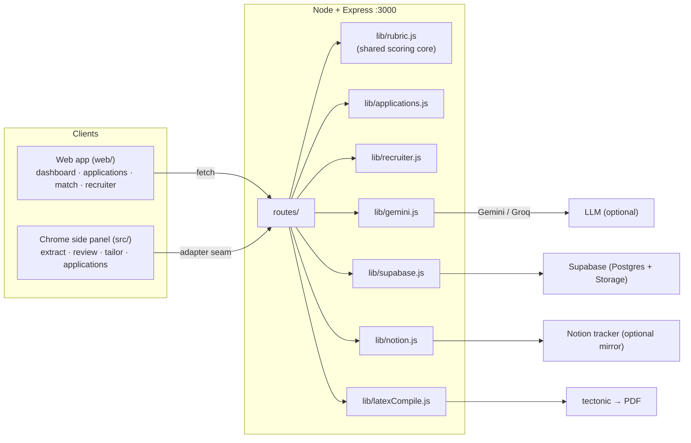

# JOZY — Jobs Made Easy

**A memory for your job search, and a fair, explainable way to match resumes to job descriptions — from either side of the hiring table.**

JOZY remembers every role you applied to, when, and the exact resume you sent, so a callback six months later doesn't catch you cold. It turns any job description into an explicit, weighted rubric — then lets you spend as little or as much effort on it as it deserves: a **quick review** of the resume you already have, or a **full tailor** written from your master profile. The same rubric engine runs the **recruiter side**, scoring a batch of applicants against one posting with the reasoning shown.

It runs as a **web app** and as a **Chrome side panel**, on one backend.

---

## Table of contents

- [Why this exists](#why-this-exists)
- [The rubric engine](#the-rubric-engine)
- [Architecture](#architecture)
- [The three workflows](#the-three-workflows)
- [Tech stack](#tech-stack)
- [Resilience: mocks, fallbacks, and rate limits](#resilience-mocks-fallbacks-and-rate-limits)
- [Setup](#setup)
- [Project structure](#project-structure)
- [Data models](#data-models)
- [API reference](#api-reference)
- [Tests](#tests)
- [Troubleshooting](#troubleshooting)
- [Roadmap](#roadmap)

---

## Why this exists

Customer discovery (10 interviews, ~25–30 survey responses) moved the product off its original premise. Three findings shaped what is built here:

**1. The pain is memory, not speed.** We assumed the problem was the 20–30 minutes spent tailoring a resume. It isn't. Reply windows run 19–24 weeks; one candidate applied to an MNC in January and got the call in July with no reliable memory of what they had sent. Time saved is a secondary benefit.

> So **applications are the core data model**, not resumes. An application exists whether or not JOZY generated a resume for it, you can backfill ones you made before you had this tool, and the dashboard leads with what is going stale rather than with a "tailor a resume" button.

**2. Effort should be a choice.** *"Not every application needs full tailoring, sometimes I just want it reviewed."*

> So there are **two modes, and neither is the default**. Quick review scores the resume you already have and tells you exactly what to change; it never rewrites anything. Full tailor rewrites from your master profile.

**3. Matching logic can't assume tech.** A law candidate pointed out that ATS keyword tools quietly assume software roles and are useless for legal terminology.

> So the scorer is **domain-aware**, with vocabularies for law, finance, healthcare, marketing, sales, design, operations, HR and education — plus a general path that derives criteria from the posting's own language when the domain is unknown.

And the recruiter side — resumes screened manually against inconsistent criteria, with ATS tools that are expensive and rigid — turns out to be *the same problem from the other end*. It is served by the same engine.

---

## The rubric engine

This is the core of the product, in [backend/lib/rubric.js](backend/lib/rubric.js).

A job description is turned into an explicit, weighted list of **criteria**. Any resume is then scored against that rubric, and every point of the score traces back to a named criterion with a weight and a quote from the resume.

```
                    ┌──────────────────┐
   job description →│  deriveRubric()  │→ [{ label, kind, weight, terms, mustHave }]  (sums to 100)
                    └──────────────────┘
                              │
                    ┌─────────┴──────────┐
                    ▼                    ▼
        scoreAgainstRubric()      rankCandidates()
         one resume vs JD          many resumes vs JD
              │                          │
     "your match is 82,          "candidate 3 of 40,
      here is the gap"            here is why"
```

Because a job seeker's match score and a recruiter's shortlist are produced by *the same function*, they are directly comparable — which is what makes the two-sided thesis testable rather than merely asserted. The recruiter workspace tracks `rubricAgreement`: how often the rubric's ranking agreed with the human's actual shortlist calls.

Three properties it commits to:

- **Weighted.** Criteria carry a share of 100 points. Editing weights re-scores every candidate immediately.
- **Explainable.** Each criterion reports matched / not found, the terms searched for, and the line of the resume that evidenced it. No opaque score.
- **Honest about hard requirements.** A stated hard requirement (a degree, a licence, a minimum number of years) that isn't evidenced *caps* the score rather than nudging it, because in practice it usually ends the application.

The rubric is derived by a model when one is configured, and by a local analyser — domain lexicons, requirement-section parsing, qualification patterns, phrase salience — when one isn't. **The local path is the one every user hits before adding an API key, so it is the one under test.**

---

## Architecture



Two design seams worth knowing:

- **The adapter seam.** The extension talks to the backend only through [src/lib/api.js](src/lib/api.js), which points at either the HTTP adapter or an in-panel mock. Flip `USE_MOCK` and the whole panel demos with no backend at all.
- **Capability, not keys.** Every integration falls back to a local implementation when its key is absent, so the entire product runs end to end before a single credential exists. `GET /health` reports which are live.

---

## The three workflows

### 1. Remember an application

Log a role from the web app, from the side panel after a review, automatically on approval of a tailored resume, or backfill one you applied to months ago. Then: move it through the pipeline (`saved → applied → screening → interview → offer / rejected / withdrawn`), keep notes, set a next action.

Every status change appends to a timeline rather than overwriting it. JOZY flags an application as needing a chase when an explicit reminder comes due, or when it has gone quiet longer than that stage normally does (21 days after applying, 14 in screening, 10 mid-interview). Terminal states are never chased.

### 2. Match a resume to a role

Paste or extract a job description → see the rubric → then choose:

| | Quick review | Full tailor |
|---|---|---|
| What it does | Scores the resume you already have | Rewrites from your master profile |
| What you get | Score, per-criterion gaps, specific edits to make yourself | A new tailored resume, refinable by chat |
| Changes your resume? | **No** | Yes |
| Ends with | Log the application | Approve → PDF + stored version + application record |

Approving compiles the resume to a real PDF, stores it, and ties it to the application — so months later you can produce the exact file you sent.

### 3. Screen candidates (recruiter)

Open a requisition from a job description. JOZY drafts the weighted rubric; **you edit it before anyone is screened**, because shortlisting criteria that live in a reviewer's head can't be defended or repeated. Paste in resumes; each is scored on arrival. Shortlist or reject — your decisions are recorded as *human* decisions, so the agreement between the rubric and your real calls is measurable.

---

## Tech stack

| Layer | Choice | Why |
|---|---|---|
| Web app | Plain ES modules, no build step | Same vocabulary as the panel; edit and reload |
| Extension | Chrome Manifest V3 side panel | Stays open through a multi-step flow |
| Backend | Node.js + Express | Keeps API keys off every client |
| Matching | Own rubric engine (no dependencies) | Deterministic, explainable, works offline |
| AI | Gemini, with Groq fallback | Optional — improves rubric and writing quality |
| PDF | tectonic (bundled) | Real LaTeX → PDF, no system TeX install |
| Data | Supabase (Postgres + Storage over REST) | Profile, applications, versions, PDFs |
| Tracker | Notion API | An optional mirror, never the source of truth |

No paid APIs. Every service has a free tier or is self-hosted.

---

## Resilience: mocks, fallbacks, and rate limits

- **No keys?** Every integration mocks locally and the whole flow still runs.
- **No model?** The rubric engine's local path takes over. It is fully tested.
- **Model rate limited?** Retry with backoff honouring Google's suggested delay, then Groq, then local.
- **No TeX engine?** The LaTeX source is stored and remains downloadable; the PDF is skipped.
- **Notion down?** Logged and ignored. An application record is never lost to a tracker outage.

---

## Setup

### 1. Backend

```bash
cd backend
npm install
cp .env.example .env      # every key is optional
npm start                 # http://localhost:3000
```

| Key | Purpose |
|---|---|
| `GEMINI_API_KEY` / `GEMINI_MODEL` | Primary LLM (free tier) |
| `GROQ_API_KEY` / `GROQ_MODEL` | Fallback LLM |
| `SUPABASE_URL` | Base project URL (a pasted REST endpoint is normalised) |
| `SUPABASE_SERVICE_ROLE_KEY` | Service role key |
| `NOTION_TOKEN` / `NOTION_DATABASE_ID` | Optional tracker mirror |
| `LATEX_ENGINE` | `tectonic` (default) or `pdflatex` |

Without `SUPABASE_URL`, the backend serves a single shared demo user and the web app skips the login wall — useful for a first run.

### 2. Database

Run [backend/db/schema.sql](backend/db/schema.sql) once in the Supabase SQL Editor. It is safe to re-run and adds new columns idempotently. The `resumes` storage bucket is created on first use.

### 3. Web app

Already served: open **http://localhost:3000/**.

### 4. Extension

`chrome://extensions` → Developer mode → Load unpacked → select the repo root.

---

## Project structure

```
web/                        Standalone web app (no build step)
  index.html  app.css  app.js
  lib/          api.js, ui.js
  views/        dashboard, applications, match, recruiter, profile, auth
src/                        Chrome side panel
  sidepanel/    shell, styles, router, theme
  lib/          api.js (adapter seam), httpAdapter, mockAdapter, mockExtras, store, extract
  ui/           screens.js, components.js
backend/
  server.js                 Express app, routes, static hosting of web/
  config.js                 Env + which integrations are live
  routes/                   One file per endpoint
  lib/
    rubric.js               ★ shared scoring core (derive, score, rank)
    applications.js         Application memory, follow-ups, funnel
    recruiter.js            Requisitions, candidates, agreement metric
    gemini.js               LLM calls + local fallbacks
    supabase.js  notion.js  latexCompile.js
  test/                     node:test suites (offline)
  db/schema.sql             Postgres schema
```

---

## Data models

**`applications`** — the core record. `company`, `position`, `source_url`, `jd_text`, `domain`, `status`, `status_history` (append-only timeline), `next_action` / `next_action_at`, `notes`, `tags`, `resume_version_id`, `applied_at`, `updated_at`.

**`resume_versions`** — a generated resume, linked to its application. `application_id`, `ats_score`, `ats_breakdown` (the full scored rubric), `structured_content`, `resume_url`, `latex_source`.

**`requisitions`** — an open role plus its **stored** rubric: `{ domain, criteria: [{ id, label, kind, weight, terms, mustHave }] }`. Stored rather than recomputed so a shortlist stays reproducible.

**`candidates`** — a screened resume: `score`, `breakdown` (per-criterion evidence), `decision`, `decided_by`.

**`master_profiles`** — your structured background, as one JSON blob.

---

## API reference

| Method & path | Purpose |
|---|---|
| `GET /health` | Which integrations are live vs mocked |
| `POST /api/auth/signup` · `/login` | Supabase Auth, proxied |
| `GET/POST/PATCH /api/master-profile` | Structured background |
| `POST /api/extract-jd` | Clean a scraped page into company / position / JD |
| `POST /api/rubric` | **Derive the weighted criteria for a JD** |
| `GET /api/rubric/domains` | Domains with known vocabulary |
| `POST /api/review-resume` | **Quick review** — score + suggested edits, no rewrite |
| `POST /api/generate-resume` | **Full tailor** — write/refine against the rubric |
| `POST /api/approve-resume` | Compile PDF, store version, create + link application |
| `GET /api/applications` | List / search / filter (`q`, `status`, `domain`) |
| `GET /api/applications/overview` | Pipeline, funnel, follow-ups due |
| `GET /api/applications/statuses` | The pipeline vocabulary |
| `POST/PATCH/DELETE /api/applications[/:id]` | Log, update status, delete |
| `GET /api/search-resumes` | Stored resume versions |
| `POST /api/interview-prep` | Questions and focus areas for a role |
| `GET/POST /api/requisitions` | List / open a role (drafts its rubric) |
| `GET/PATCH/DELETE /api/requisitions/:id` | Workspace; editing the rubric re-scores everyone |
| `POST /api/requisitions/:id/candidates` | Add resumes, scored on arrival |
| `POST /api/requisitions/:id/rescore` | Re-run the batch |
| `PATCH /api/requisitions/:id/candidates/:cid` | Shortlist / reject |

---

## Tests

```bash
cd backend && npm test
```

66 tests across the rubric engine, application memory and the recruiter flow. They pin the stores to their in-memory paths and use no API key, so they run offline and deterministically — and they cover the code path an unconfigured install actually executes.

---

## Troubleshooting

- **`SUPABASE_URL` mistakes.** Pasting the REST endpoint instead of the base URL is handled — the code trims it back.
- **Gemini 429.** Free-tier per-minute/per-day limit. Backoff retries, then Groq, then local generation.
- **`column does not exist`.** Re-run [backend/db/schema.sql](backend/db/schema.sql).
- **Port 3000 in use.** PowerShell: `Get-NetTCPConnection -LocalPort 3000 -State Listen | ForEach-Object { Stop-Process -Id $_.OwningProcess -Force }`
- **First PDF is slow.** tectonic downloads its package bundle once (1–2 minutes), then compiles take seconds.

---

## Roadmap

Ordered by the open questions from discovery, not by how easy they are:

- **Validate memory-first vs speed-first messaging.** Does *"never lose track of what you applied to"* beat *"tailor in 2 minutes"*? The product is built memory-first; that is a hypothesis, not a finding.
- **Recruiter interviews.** The recruiter module is built on secondary research and hackathon feedback. `rubricAgreement` exists to make the correlation between rubric ranking and real shortlisting measurable — it needs real recruiters to measure it against.
- **Domain coverage beyond one data point.** The law example drove the domain-aware design. Whether other non-tech fields hit the same wall is untested.
- Resume file parsing (PDF/DOCX) for bulk recruiter intake.
- Status sync back from Notion.
- Model choice per user, with cost/quality guidance.

---

## Logo and icon attribution

<a href="https://www.flaticon.com/free-icons/socket" title="socket icons">Socket icons created by Freepik - Flaticon</a>
